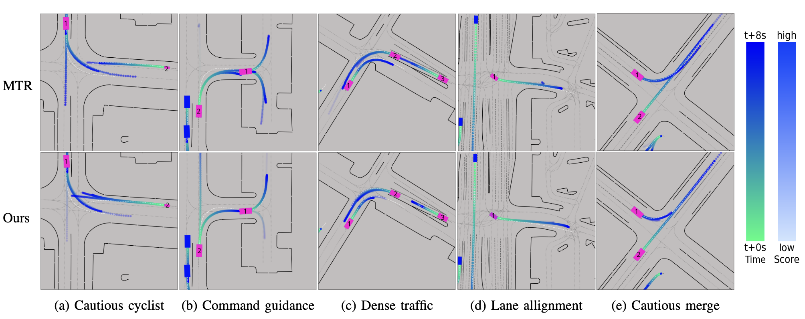
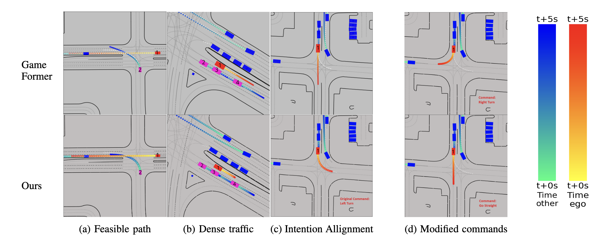

# PlanTRansformer (PTR)
### Unified Prediction and Planning with Goal-conditioned Transformer

This repository contains the implementation for PlanTRansformer (PTR), a unified framework that bridges the gap between trajectory prediction and autonomous vehicle planning.

---

## 🚀 Project Status
**The source code is currently being prepared for release. Visualizations and qualitative results are provided below.**

---

## Abstract
Trajectory prediction and planning are fundamental yet often disconnected components in autonomous driving. PTR introduces a unified Gaussian Mixture Transformer framework that integrates goal-conditioned prediction, dynamic feasibility, and lane-level topology reasoning. By employing a teacher-student training strategy, the model learns to handle unknown agent intentions while producing safe and feasible ego-trajectories. PTR achieves significant improvements in planning error and prediction accuracy on the Waymo Open Motion Dataset compared to established baselines.

---

## 📊 Quantitative Results

PTR was evaluated on the **Waymo Open Motion Dataset (WOMD)** for both motion forecasting and open-loop planning tasks.

### Motion Prediction Performance
PTR outperforms the state-of-the-art Motion Transformer (MTR) by incorporating goal-conditioned guidance and planning constraints.

| Task | Metric | MTR (Baseline) | PTR (Ours) | Improvement |
| :--- | :--- | :---: | :---: | :---: |
| **Marginal Prediction** | mAP ↑ | 0.4013 | **0.4185** | **+4.3%** |
| **Joint Prediction** | mAP ↑ | 0.2097 | **0.2170** | **+3.5%** |

### Open-Loop Planning Performance
Compared to GameFormer, PTR significantly reduces planning errors and improves trajectory fidelity.

| Metric | GameFormer | PTR (Ours) | Improvement |
| :--- | :---: | :---: | :---: |
| **Planning Error @ 1s** ↓ | 0.129m | **0.117m** | -9.3% |
| **Planning Error @ 3s** ↓ | 0.836m | **0.835m** | -0.1% |
| **Planning Error @ 5s** ↓ | 2.451m | **2.340m** | **-15.5%** |
| **Ego ADE** ↓ | 0.853m | **0.669m** | **-21.5%** |

---

## Qualitative Results

### Multi-Agent Prediction
PTR produces multimodal predictions that adhere to lane boundaries and respect agent interactions. The model maintains high map consistency and semantic alignment even in complex dense traffic.



### Goal-conditioned Planning
Ego-vehicle planning is guided by high-level navigation commands. PTR adaptively modulates its trajectory based on navigation intent while maintaining safe buffers from surrounding agents.



---

## Key Features
* **Goal-Conditioned Decoding**: Uses high-level commands to guide query initialization.
* **Safety-First Planning**: Integrates differentiable collision and dynamics losses.
* **Route Awareness**: Explicitly incorporates reachable lane features into the transformer decoder.
* **Unified Architecture**: Handles both multimodal prediction and deterministic planning in a single pass.

---

## Architecture Overview
1. **Scene Encoding**: Processes agent history, map geometry, and reachable lanes through polyline encoders and local-attention transformers.
2. **Motion Decoding**: Refines command-guided queries through self-attention and cross-attention with the scene context.
3. **Multi-Objective Learning**: Jointly optimizes for imitation accuracy, physical feasibility, and collision avoidance.

---

## Citation
If you find our work useful, please cite our paper:

```bibtex
@inproceedings{selzer2026plantransformer,
  title={PlanTRansformer: Unified Prediction and Planning with Goal-conditioned Transformer},
  author={Selzer, Constantin and Flohr, Fabian},
  booktitle={IEEE International Conference on Intelligent Vehicles (IV)},
  year={2026}
}
